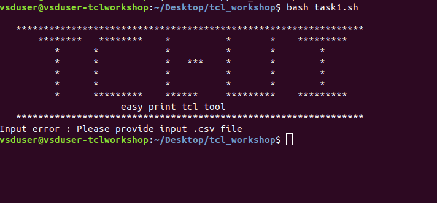
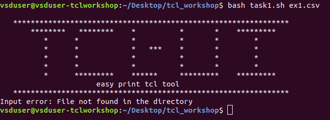
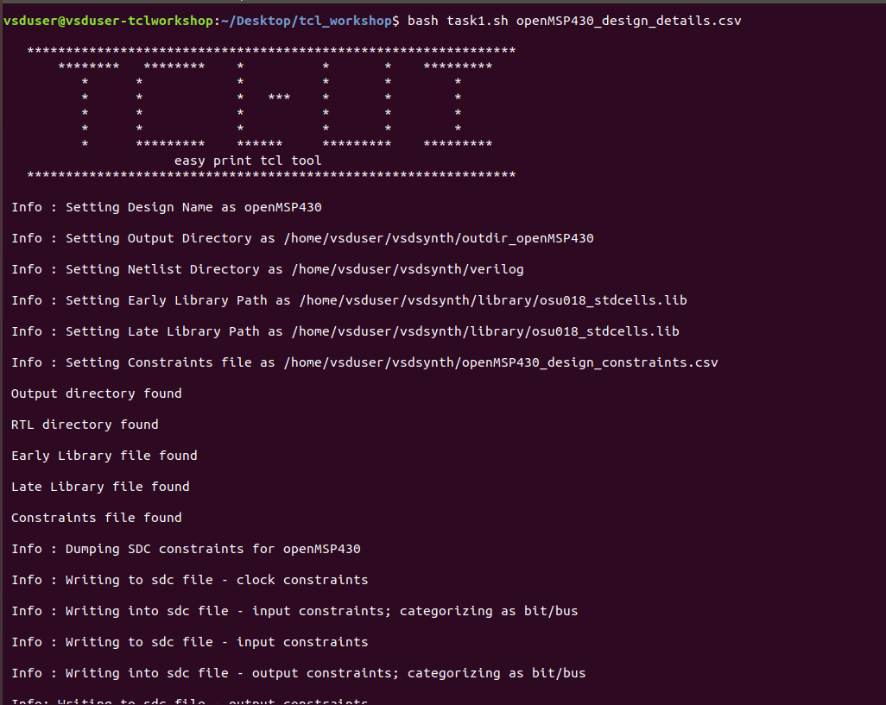
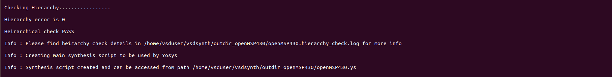
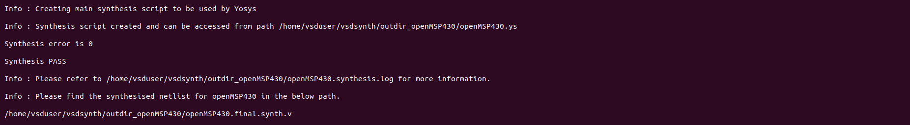
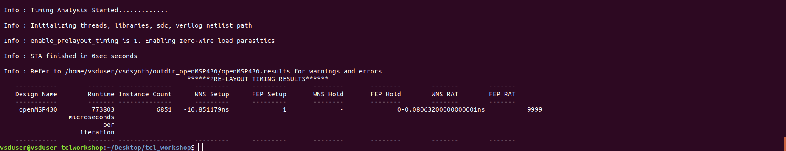

# TCL_workshop_July23

## **FILES UPLOADED**
1. shell script (task1_done.sh)
2. main tcl file (task2_done.tcl)
3. proc files used (.proc)
\
\
####################################################################################\
#####################################**DESCRIPTION**####################################\
####################################################################################\
task1.sh is the shell script which calls the tcl script task2.tcl\
Comments are yet to be made, only uploaded the finished code.

## **TASK 1**
The way to run the shell script is 'bash task1.sh example.csv'\
According to the specifications the shell script must give an error on invalid input, and it does for both the cases.\
Case 1 : No input file given\
\
Case 2 : Input provided is not in the same directory\
\
It also prints out a help option on suffixing '-help' to the command\
## **TASK 2**
### **PART-1 : CREATING THE SDC FILE** 
The tcl script is called from the shell script.\
The algorithm used is similar to what is recommended in the videos. However as I had trouble with a few commands. I had to modify the algorithm.\
**Modifications:**\
Finding which inputs are bits/buses : On using the command "lsort -unique" to remove duplications, we also lose the order in which the inputs are present which is key for further steps.\
The 'count' logic did not work, I kept getting a very high value no matter how hard I tried.\
To overcome these I used regexp and arrays to modify and store the input ports and their corresponding row values which I had to recalculate due to the "lsort -unique " command.\
I used the regexp {\w+[^(\[\d*:\d*\])]} to split the given line. Stored the values I need into arrays and used these values later while printing into the sdc and defining the boundaries of the rectangle used to search for delays/clocks needed.\

### **PART-2 : SYNTHESIS SCRIPT, HIERARCHY AND SYNTHESIS PASS**

Initially, both hierarchy and synthesis did not pass as I had left some extra spaces between the liberty/setattribute command.

### **PART-3 : TCL PROCS**
Each of the proc was first written with a .tcl extension, tested and then finally changed to .proc. 
set_multi_cpu_usage and read_lib make use of associative arrays.I have used associative arrays to test memory modules in system verilog, but found the usage here very apt.\
Having missed a few indentations in the read_sdc proc gave me some difficulty to obtain the output from OpenTimer. Was able to resolve it and have the final output.\
I wanted to use regexp to solve a few tasks we had in read_sdc but due to lack of time decided to go with the algorithm recommended.

### **PART-4 : EDITING INPUTS FOR THE TIMING TOOL**
Using the procedure files we are able to edit the inputs needed for OpenTimer.

### **PART-5 : PRINTING THE OUTPUT IN A TABLE FORMAT**
The output obtained is :

